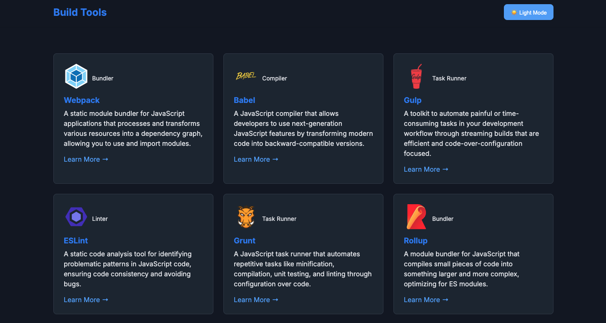
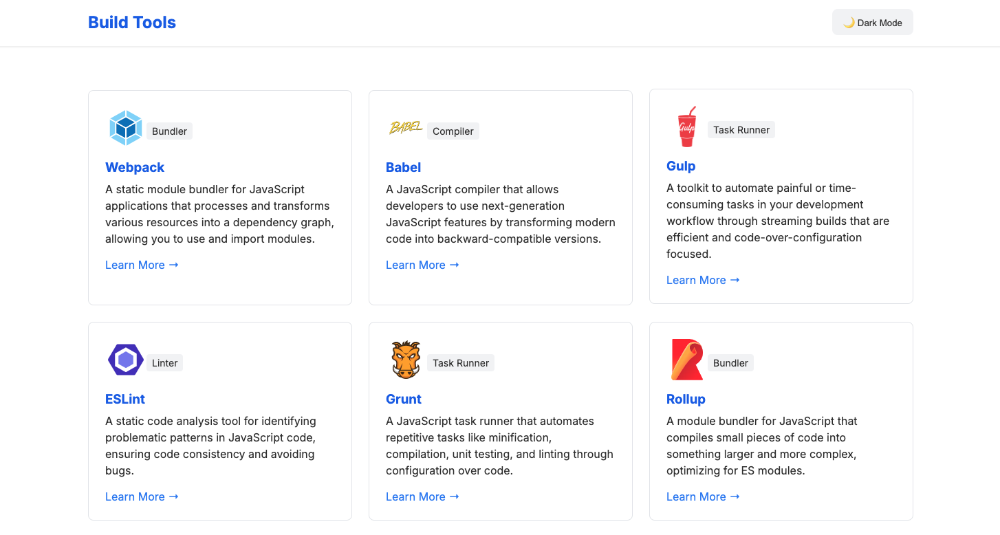

# Build Tools

showcase a list of build tools and their usage.

Live URL: [https://vb-build-tool-showcase.netlify.app/](https://vb-build-tool-showcase.netlify.app/)

## 📌 Table of Contents

- [🚀 Getting Started](#-getting-started)
- [🛠️ Tech Stack](#-tech-stack)
- [📦 Installing](#-installing)
- [💻 Running the Application](#-running-the-application)
- [📋 Approach](#-approach)
- [📸 Screenshots](#-screenshots)
- [🚀 Deployment](#-deployment)
- [👤 Author](#-author)

## 🚀 Getting Started

## 🛠️ Tech Stack

- HTML
- SASS
- JavaScript
- Jest
- Typescript
- Webpack
- Eslint
- Prettier
- Husky

## 📦 Installing

Clone the repository and run the command:

```sh
git clone https://github.com/victorbruce/build-tool
cd build-tool
```

## 💻 Running the Application

Once in the projects' root directory:

1. Install all the dependencies used in the project by running the command:
   `npm install`
2. Start the development server by runnig `npm run dev`.

This will automatically open a browser with url `http://localhost:3000`

**Production Build:**

`npm run build`

**Running the tests:**

To run the test, run `npm run test`

To get the test coverage, `npm run test-coverage`

## 📸 Screenshots

**Dark Mode**



**Light Mode**



## 📋 Approach

**Setting up Webpack**

I approached this project by setting up the base configurations I needed to make webpack bundle my files and assets. I did that by:

- Installing webpack and webpack cli `npm install webpack webpack-cli --save-dev`

- Next I created two main folders; `src` and `dist`. The `scr` folder contains code we write and edit whiles the `dist` folder contains code that is minimised and optimised output of our build process that will be loaded into the browser.

- After I created a `webpack.config.js` file to bundle my files

**Setting up Typescript**

- Installed typescript and ts-loader. `ts-loader` guides webpack on how to transform our typescript into a format webpack can work with

- After, I added a `tsconfig.json` file to set rules for typescript and also define an output directory

**Setting up a Web Development Server with WebPack**

Added the feature to automatically compile my code and run a development server using `webpack-dev-server` which provides you with a **rudimentary web server** and the ability to use **live reloading**.

Other ways to watch your files automatically with webpack are:

- webpack’s **watch mode**: compiles code when a file you’re watching changes but does not build the code hence you’ll have to manually refresh your browser to see changes. Under scripts in your package.json file, add `"watch: "webpack --watch"`

- `webpack-dev-middleware`

**Automatically generate HTML file**

Since I didn't want to manually add an html to my `dist` folder. I added the HTML plugin to automatically do that.

Plugins: `html-loader` and `html-webpack-plugin`

**Asset Management**

Next, I had to find a way to bundle assets such as css, sass, and image files using webpack. I achieved that by installing the following dependencies:
`npm install --save-dev style-loader css-loader sass-loader, sass`

Next, I configured ESLint, Prettier, and added Husky to run linting and formatting checks before each commit.

**Finally**, I built my UI, made it functional, and wrote test.

## 🚀 Deployment

Netlify

## 👤 Author

Victor Bruce
